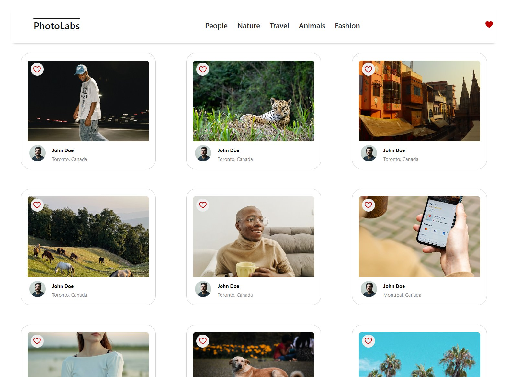
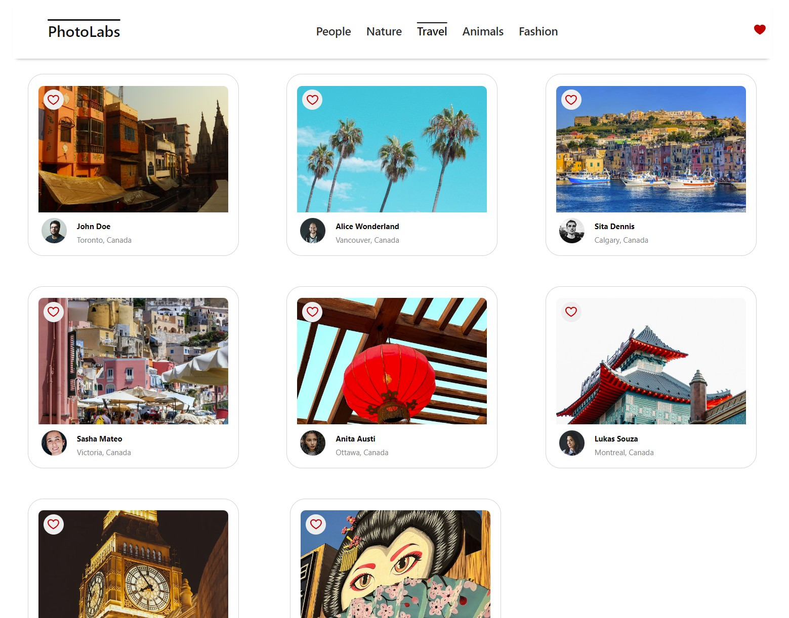
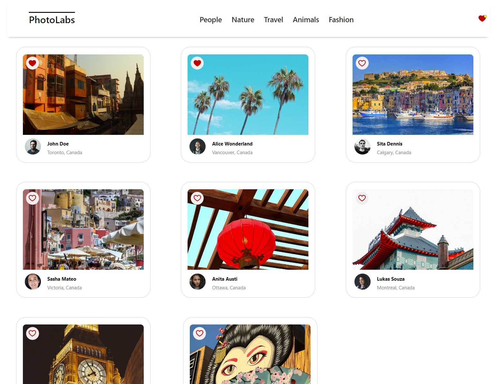
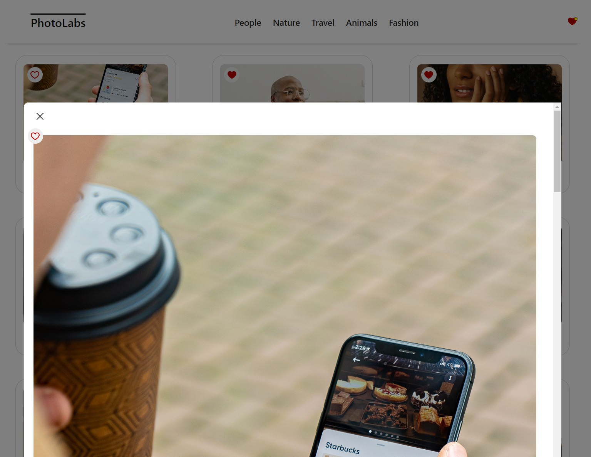

# PhotoLabs REACT Project

PhotoLabs is a React-based single-page application (SPA) that allows users to view photos in different contexts. We used a pre-existing API to build a frontend user experience for users to interact with photos!

## Goal:
Build a client-side application using the React view-layer library.

## Screenshots

## Dependencies

- testing-library/jest-dom
- testing-library/react
- testing-library/user-event
- react
- react-dom
- react-scripts
- web-vitals

## Technical Specifications with API References
- React
- Create React App
- Webpack
- Babel
- Express

The PhotoLabs client application will use Create React App (CRA) and Express will be the basis for the PhotoLabs API server application.

Note that two different servers will be running during development:

Client-side Webpack development server and API server to provide photo data.

** Not for production use.

